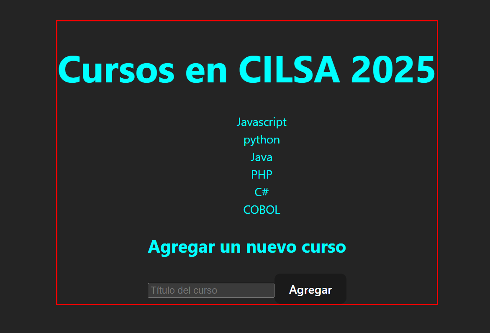

# Proyecto FULL



## Explicación de ejecución

Como estamos trabajando con un backend hecho en Node.js/Express y un frontend con React, es habitual que tengas que correr ambas partes del proyecto por separado.

Backend: Necesitas tener tu servidor Express corriendo para que maneje las solicitudes HTTP (por ejemplo, las que llegan a /api/cursos) y gestione la base de datos SQLite.
Frontend: React tiene su propio servidor de desarrollo (normalmente en el puerto 3000), que te permite visualizar y trabajar en la interfaz de usuario, haciendo solicitudes al backend.

Esto generalmente implica abrir dos terminales:

1. Terminal para el Backend (Node.js/Express)
En una terminal, te vas a dirigir a la carpeta donde está el backend y ejecutar el servidor de Express. Aquí tienes los pasos:

1.1 Abre una terminal.
1.2 Navega hasta la carpeta del backend (donde está el archivo server.js o similar).

```bash
cd ruta/del/backend
```
En mi caso es: cd backend-express-sqlite/src
1.3 Inicia el servidor con Node.js.
```bash
node server.js
```

O si tienes un script configurado en el archivo package.json del backend, como "start": "node server.js", puedes ejecutar:
```bash
npm start
```


2. Terminal para el Frontend (React)
En la segunda terminal, vas a iniciar el servidor de desarrollo de React (normalmente con npm start o yarn start).
En nuestro caso, como utilizamos Vite, el comando para iniciar el servidor de desarrollo es "npm run dev"

2.1 Abre una nueva terminal.
2.2 Navega hasta la carpeta donde está el frontend (donde está la aplicación React, generalmente la carpeta frontend o similar).

```bash
cd ruta/del/frontend
```
En mi caso es /frontend-react/

2.3 Inicia el servidor de React.
```bash
npm run dev
```


## Rutas

- Probar usando la pagina y el formulario.
- Probar una solicitud de la ruta GET: Visita http://localhost:3001/ para obtener el listado de cursos.
- Probar una solicitud de la ruta POST: sobre la misma url raíz.
    - Completar el Formulario.
    - Usa Postman o un cliente similar para hacer una solicitud POST a http://localhost:3001/ con un cuerpo JSON como este:
        {
        "titulo": "Nuevo curso"
        }

